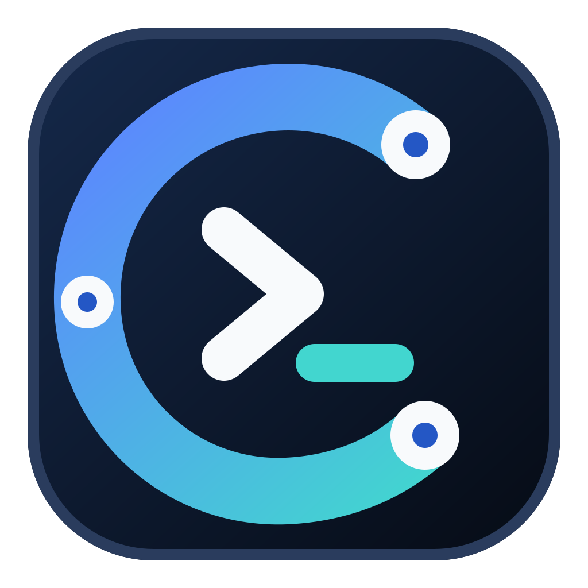

  

# Clidarvi

Clidarvi is a local desktop app for organizing network devices, reviewing command
plans, running supported automation, and opening host-key-verified SSH sessions.

It started as a Python script I used for network work. I kept building it because I
wanted something between opening one SSH session at a time and deploying a complete
automation platform. It is meant for network engineers who know their infrastructure
but may not have a dedicated automation team or expensive SDN tools.

I work in automation and security, and both shaped how I built Clidarvi. The app runs
locally and does not need a server.

> **Clidarvi is an unreleased experimental alpha.** Real-device testing is still
> limited. The planned release artifact, Experimental Automation, and the fixed UDM
> diagnostics have not completed the full field-test checklist, and Clidarvi has not
> been tested in production. Start with lab or recoverable equipment. Keep working
> backups and out-of-band access available.

## What you can do

- Organize sites, data centers, folders, and devices in one inventory.
- Select a device, folder, or complete site as an Automation target.
- Review the expanded target list and command plan before a supported run starts.
- Run supported targets in parallel, with commands kept sequential per target and
  enforced time and output limits.
- Confirm changing plans and type an exact approval phrase for unknown or destructive
  plans.
- Work with several host-key-verified Live CLI sessions at once.
- Save optional, size-limited Automation transcripts with best-effort secret
  redaction.
- Import and export validated JSON inventories with atomic saves and
  last-known-good recovery.

The device role controls its inventory icon. The platform profile controls how
Clidarvi connects and whether Automation is available.

## How a run works

1. Add or import your devices.
2. Verify each SSH fingerprint through an independent source.
3. Select your targets and write the command plan.
4. Check the expanded targets and every command in that plan.
5. Complete any approval step Clidarvi asks for and watch the bounded output.

Live CLI is different. Clidarvi verifies the SSH host key, but it does not classify
or approve commands typed into an interactive session. You are responsible for every
command you enter there.

## Platform support

Automation currently has two paths: a standard alpha path and a much narrower
experimental lab path. Neither means that a device is compatible, read-only, safe,
or production-ready. Test your exact model, firmware, account, and commands in a
disposable lab.

Only correctly matched Cisco IOS and PAN-OS profiles can enter the standard alpha
path.

| Platform profile | Live CLI | General Automation |
|---|:---:|---|
| Cisco IOS | Yes | Standard alpha path |
| Palo Alto PAN-OS | Yes | Standard alpha path |
| Aruba OS | Yes | Experimental lab path: one target |
| Cisco WLC | Yes | Experimental lab path: one target |
| Fortinet | Yes | Experimental lab path: one target |
| Ubiquiti UniFi OS / UDM family | Yes | No; separate fixed UDM diagnostics only |
| Generic SSH | Yes | No |

So far, I have completed one limited development-worktree test of the fixed UDM
diagnostics on an owned UniFi Dream Machine SE running UniFi OS 5.1.26. It was not a
frozen-artifact field test and does not validate other models or firmware.

Generic SSH stays Live-CLI-only because it has no validated platform-specific
Automation driver. UniFi OS also stays outside General Automation; it has Live CLI
and a separate diagnostics mode limited to one target and a fixed command set.

Vendor names identify device families only. Clidarvi is not affiliated with or
endorsed by those vendors.

## Install from source

For the locked setup below, you need Git and CPython 3.13. On Ubuntu or Debian, PyQt
may also require the `libegl1` system package.

The package supports Python 3.11 through 3.13. The locked development setup and
native Windows and macOS checks use Python 3.13; CI also tests all three versions on
Ubuntu.

There is no official tagged release yet. GitHub Actions artifacts are build evidence,
not release packages.

### macOS or Linux

~~~bash
git clone https://github.com/devnetdreamer/Clidarvi.git
cd Clidarvi

python3.13 -m venv .venv
source .venv/bin/activate

python -m pip install --require-hashes --only-binary=:all: \
  -r requirements-lock/dev-py313.txt
python -m pip install --no-deps --no-build-isolation -e .

clidarvi
~~~

### Windows PowerShell

~~~powershell
git clone https://github.com/devnetdreamer/Clidarvi.git
Set-Location Clidarvi

py -3.13 -m venv .venv
.\.venv\Scripts\Activate.ps1

python -m pip install --require-hashes --only-binary=:all: -r requirements-lock/dev-py313.txt
python -m pip install --no-deps --no-build-isolation -e .

clidarvi
~~~

Once an official pre-release exists, use only assets from that release and follow
the [release-verification guide](docs/VERIFY_RELEASE.md).

## First run

On first launch, when no saved inventory exists, Clidarvi includes example sites and
devices with hostnames under the reserved `.example` suffix. Replace or remove all of
them before connecting.

1. Add only equipment you own or are authorized to administer.
2. Verify every SSH fingerprint independently.
3. Select a device, folder, or site and choose **Add target**.
4. Inspect the expanded targets and every command in the Automation plan.
5. Begin with a vendor-documented observational command on lab equipment.
6. Use least privilege, a maintenance window, backups, and out-of-band access for
   real changes.

## The experimental lab path

Experimental Automation is off by default and protected by additional gates. Every
attempt requires:

- exactly one eligible target;
- locally installed package metadata reporting Netmiko exactly as version 4.7.0;
- explicit activation of lab mode; and
- the exact phrase `RUN EXPERIMENTAL AUTOMATION`, in addition to the normal
  command-risk approvals.

You must ensure that the target is isolated from production and recoverable. The
package check only reads reported metadata; it cannot prove that the installation is
unmodified, compatible, safe, read-only, or suitable for production. Clidarvi checks
that metadata before host-key lookup, credentials, or a new connection.

Netmiko drivers can send platform-specific privilege, paging, terminal, output-mode,
or other setup commands before Clidarvi sends the reviewed plan. Those setup commands
are not shown in that plan. Cleanup may not run after success, failure, Stop, or an
aborted connection, so a setup change can remain on the device. Compare device state
before and after every run.

Clidarvi does not directly request library-managed enable or automatic save after
connection. You can still include an explicit reviewed save or commit command in the
plan, and an experimental driver may invoke hidden setup helpers before control
returns to Clidarvi.

The [user guide](docs/USER_GUIDE.md) documents the complete workflow and its limits.

## Why Clidarvi is intentionally strict

Network automation can turn a small mistake into a large outage. I would rather have
Clidarvi stop than guess.

- DNS, host-key discovery, and SSH remain blocked until you complete the local risk
  acknowledgement.
- Automation and Live CLI reject untrusted or changed SSH host keys.
- Verifying a new fingerprint resolves and contacts the selected target. Trust still
  requires explicit approval, and you should compare the fingerprint through an
  independent source first.
- Telnet and serial connections are rejected.
- SSH is password-only in this alpha; agent and default-key discovery are disabled.
- Legacy SSH algorithms are disabled, even though that prevents some older devices
  from connecting.
- Unsupported Automation input is rejected.
- Prompt, time, transport, and output-check failures abort the affected connection.
- General Automation does not fall back to Generic SSH.
- Live CLI is limited to eight active sessions.

Changing commands require confirmation. Unknown and destructive plans require the
exact typed phrase shown by the application. Experimental Automation adds its own
confirmation and does not replace those command-risk checks.

Commands run sequentially per target. A command-execution failure can cancel the
complete run. Other target-specific failures are recorded while unaffected targets
may continue.

These controls reduce risk; they do not make Clidarvi a safety system.
Classification, prompt recognition, cancellation, and redaction remain heuristic.
Driver setup can happen before the reviewed plan, and Clidarvi cannot guarantee that
setup will be reversed. Read the [user guide](docs/USER_GUIDE.md) before connecting
to real equipment.

## Local data and privacy

Inventory, backups, known hosts, the local acknowledgement record, exports, and
optional transcripts are plaintext. Passwords are requested when connecting and are
not inventory fields.

Clidarvi's unmodified first-party code does not intentionally send your inventory,
credentials, commands, or transcripts back to the publisher. [PRIVACY.md](PRIVACY.md)
explains the exact scope, normal network traffic, dependency and operating-system
considerations, storage locations, credential handling, and deletion.

## Current limitations

- One username and password pair is used across a multi-device Automation run.
- Live CLI is a bounded SSH text console, not a complete terminal emulator.
- Non-ASCII Automation output can display incorrectly because policy checks preserve
  channel bytes.
- Stop is cooperative; some operating-system, library, or device operations may exit
  only after their timeout.
- Logs and transcripts are size-limited and are not a complete audit system.
- Compatibility must be validated against the exact device model and firmware.
- Password-only SSH and the disabled algorithm set are scoped mitigations for the
  pinned Paramiko advisory, not an upstream fix.
- No signed installer or standalone executable is currently provided.
- No support or response-time SLA is provided.

## Documentation

- [User guide](docs/USER_GUIDE.md): inventory, Automation, Live CLI, and recovery.
- [Inventory format](docs/INVENTORY_FORMAT.md): schema, validation, and migrations.
- [Field-test checklist](docs/FIELD_TEST_CHECKLIST.md): real-device validation.
- [Release verification](docs/VERIFY_RELEASE.md): signed tags, checksums, and provenance.
- [Privacy](PRIVACY.md): local data, network traffic, and deletion.
- [Security policy](SECURITY.md): private vulnerability reporting.
- [Operational terms](TERMS.md): the pre-network risk acknowledgement.
- [Disclaimer](DISCLAIMER.md): warranty and operational-risk notice.
- [Third-party notices](THIRD_PARTY_NOTICES.md): dependencies and licenses.

## Contributing

The most useful help right now is testing on recoverable real devices, reviewing the
code, improving documentation, reproducing bugs, and adding platform support. Read
[CONTRIBUTING.md](CONTRIBUTING.md) before opening a pull request.

The commands below use a macOS or Linux shell:

~~~bash
QT_QPA_PLATFORM=offscreen python3 -B -m unittest discover -s tests -q
ruff check .
ruff format --check .
python3 -m build --no-isolation
~~~

Report suspected vulnerabilities privately through GitHub Private Vulnerability
Reporting or `security@clidarvi.io`. Never place credentials, configurations,
host-key stores, or transcripts in a public issue.

## License and contact

Clidarvi is free and open-source software licensed under
[GNU GPL version 3 only](LICENSE). I intend to keep it free and open source. It is
provided **as is**, without warranty, to the extent permitted by applicable law. See
[DISCLAIMER.md](DISCLAIMER.md) and [TERMS.md](TERMS.md).

- General: info@clidarvi.io
- Privacy: privacy@clidarvi.io
- Security: security@clidarvi.io
